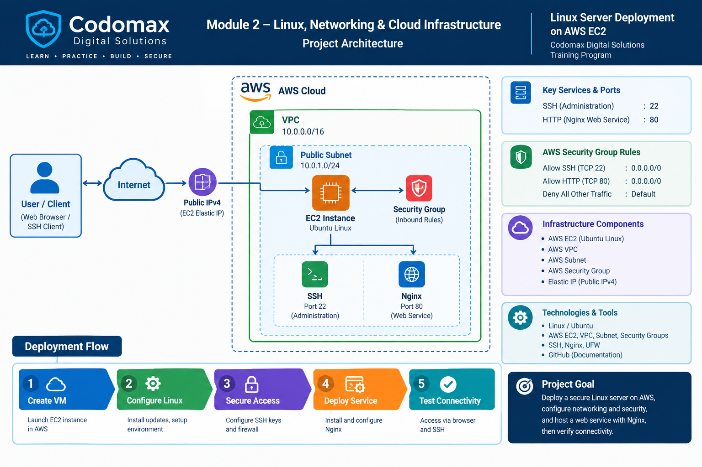

# Module 2 – Linux, Networking & Cloud Infrastructure

A practical implementation of Linux administration, networking, security, and cloud infrastructure using an Ubuntu Linux server deployed on AWS EC2.

This project was completed as part of the **Codomax Digital Solutions** training program.

---

## Project Overview

The project focuses on deploying and configuring a Linux server in AWS and applying fundamental Linux, networking, and security concepts.

The practical work covers:

- Linux Command Line Interface (CLI)
- Files and directories
- File permissions
- Users and groups
- Process management
- Linux services
- SSH and SSH key authentication
- IP addressing
- DNS
- Network ports
- Linux firewall configuration
- AWS Security Groups
- AWS VPC and Subnet
- Ubuntu EC2 server deployment
- Nginx web service deployment
- Connectivity testing

---

## Architecture

The following diagram represents the architecture used for this project:

Implementation
1. Cloud Infrastructure
- Deployed an Ubuntu Linux server using AWS EC2.
- Used an AWS VPC and subnet for network connectivity.
- Enabled a public IPv4 address for remote access and connectivity testing.
- Configured an AWS Security Group to control inbound traffic.
  
2. Linux Administration
Practical Linux tasks included:
- Navigating the Linux filesystem
- Creating files and directories
- Managing file permissions
- Creating and managing users and groups
- Monitoring processes
- Checking and managing services
- Generating SSH keys
  
3. Networking & Security
The project included practical work with:
- IP addressing
- DNS resolution
- Network ports
- Linux firewall rules
- AWS Security Group inbound rules
- SSH access on TCP port 22
- HTTP access on TCP port 80
  
4. Web Service Deployment
Nginx was installed and configured on the Ubuntu server.
The service was tested locally and through the server's public IPv4 address using a web browser.

Connectivity Testing

The deployed web service was tested using:

HTTP
Port: 80
Service: Nginx

SSH administration was tested using:

SSH
Port: 22
Authentication: SSH Key

The EC2 public IPv4 address is not permanently documented in this repository because public IP addresses can change when an EC2 instance is stopped and started.

Documentation
The complete practical documentation is available in:
[Module 2 Project Report.pdf](./Module 2 Project Report.pdf)

The report contains the detailed steps, configurations, commands, screenshots, and practical evidence for the completed module.

Project Structure
Codomax-Module-2-AWS-EC2-Linux-Nginx/
│
├── README.md
├── Module-2-Report.pdf
└── architecture-diagram.jpg

Learning Outcomes
Through this project, I gained practical experience with:
- Linux server administration
- AWS EC2 deployment
- Basic AWS networking
- Network security controls
- SSH-based server administration
- Linux permissions and user management
- Firewall configuration
- DNS and network troubleshooting
- Web service deployment
- Cloud infrastructure documentation
  
Training Program
Codomax Digital Solutions

Module 2 – Linux, Networking & Cloud Infrastructure
Author: Sikandar Shah

### About the EC2 instance

After you have **finished taking your screenshots, completed the PDF, tested the website, and submitted the GitHub link**, I recommend **stopping the EC2 instance** rather than leaving it running.

Why:

- It prevents unnecessary compute usage/cost.
- Your GitHub/PDF remains as your permanent project evidence.
- You don't need a live server for the assignment once testing is complete.

**Don't terminate it yet** if you still need to demonstrate the live webpage to someone. Stop it after your final testing and after you've uploaded the report to GitHub.

Also, if you later start the instance again, the **public IPv4 may change**, so don't hard-code today's `3.110.105.185` into the README.

Would you like me to tailor the README to your exact architecture diagram filename and the services you actually configured?
